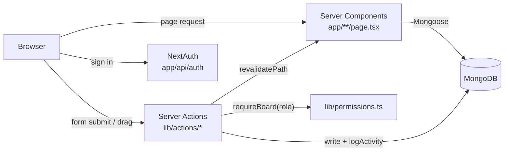
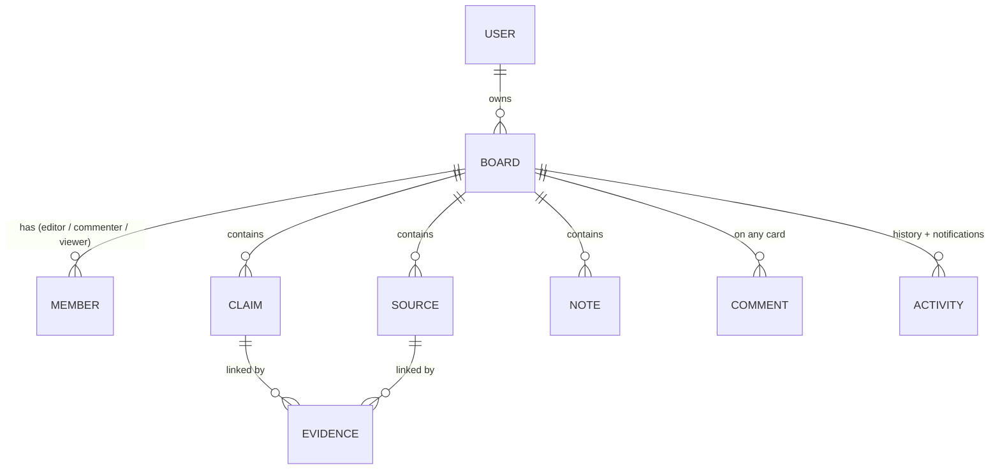

# Warrant

**A research notebook for claims and evidence.** Pin a claim to the page, add what you're reading, and draw the lines between them: what backs it up, what cuts against it.

The name comes from Toulmin's model of argument, where the *warrant* is the reasoning that connects evidence to a claim. That connection is what this app is built around.

<!-- Replace with your deployed URL -->
**Live demo:** https://warrant-research-board.vercel.app ·


<!-- Generate with: node --env-file=.env.local scripts/screenshots.mjs, then pick your favorites -->
<!--  -->

---

## What it does

- **Research canvas.** Claims, sources and notes are cards on an infinite canvas. Drag from a claim to a source to connect them as evidence marked *supports*, *challenges* or *context*. Card positions are saved as you move them.
- **Card details and discussion.** Click any card or link to open a side panel with its description, linked evidence and a comment thread.
- **Collaboration with roles.** Boards are private or public. Owners invite people by email or username as **editor**, **commenter** or **viewer**, and the server enforces those roles on every action.
- **History and notifications.** Every change is logged. Each board has a filterable timeline, and collaborators' activity shows up in a notification menu.
- **Discovery.** Browse public boards by topic, sort by most discussed, search across boards, claims, sources, notes, tags and people, and view public researcher profiles.
- **Built for phones too.** On small screens the canvas tools move to a bottom action bar and panels become bottom sheets.

## Design

Warrant is designed like a field notebook rather than a SaaS dashboard: cream graph paper, claims on index cards set down at slight angles, evidence drawn as ink lines with handwritten labels (green for *supports*, red dashes for *challenges*), red-pencil margin notes and a highlighter.

- Every hand-drawn shape comes from a small seeded generator (`lib/rough.ts`), so the lines wobble like real pencil but render identically on the server and in the browser, and a card never jiggles between renders.
- Reusable pieces live in `components/paper/` (`IndexCard`, `Tape`, `HandNote`, `Highlight`, `HandCircle`), with a pencil-drawn icon set in `components/icons/`.
- Type: Newsreader for headings and claims, IBM Plex Sans for the interface, IBM Plex Mono for labels, and Kalam, used sparingly, for handwriting.
- Every text color passes WCAG AA against its background, and motion respects `prefers-reduced-motion`.

## Tech stack

| Layer | Choice |
|---|---|
| Framework | Next.js 16 (App Router, React Server Components, Server Actions) |
| UI | React 19, TypeScript, Tailwind CSS v4, Base UI, Lucide icons |
| Canvas | React Flow (`@xyflow/react`) |
| Data | MongoDB with Mongoose |
| Auth | NextAuth: email and password (bcrypt), optional GitHub OAuth, JWT sessions |
| Testing | Vitest (unit), Playwright (end-to-end on desktop and phone viewports) |
| CI | GitHub Actions: lint, type-check, unit tests, build, E2E against a MongoDB service container |
| Hosting | Vercel + MongoDB Atlas |

## Architecture



- **Reads** happen in Server Components, which query MongoDB directly. No REST layer or client-side fetching is needed for page data.
- **Writes** go through Server Actions in `lib/actions/`. Each one checks the user's role with `requireBoard(boardId, "edit" | "comment" | "owner")`, validates input (`lib/validation.ts`), writes, records an activity row, and calls `revalidatePath` so the page re-renders with fresh data.
- **The canvas** (`components/workspace/`) is the one large client component. It turns board data into React Flow nodes and edges, keeps local positions while you drag, and merges fresh server data after every save.

### Data model



## Running locally

Requirements: Node 20+ and a MongoDB database (local or a free Atlas cluster).

```bash
npm install
cp .env.example .env.local   # then fill in the values
npm run dev                  # http://localhost:3000
npm run seed                 # optional: demo account + 3 public boards
```

### Environment variables

| Name | Required | Notes |
|---|---|---|
| `MONGODB_URI` | yes | Include the database name, e.g. `.../warrant` |
| `NEXTAUTH_SECRET` | yes | `openssl rand -base64 32` |
| `NEXTAUTH_URL` | yes | `http://localhost:3000` locally, your site URL in production |
| `GITHUB_ID`, `GITHUB_SECRET` | no | Enables "Continue with GitHub". Callback: `<NEXTAUTH_URL>/api/auth/callback/github` |
| `SEED_DEMO_PASSWORD` | for seeding | Password given to the demo accounts |

### Scripts

| Command | What it does |
|---|---|
| `npm run dev` | Start the dev server |
| `npm run build` / `npm start` | Production build and server |
| `npm run lint` / `npm run typecheck` | ESLint and TypeScript checks |
| `npm test` | Unit tests (Vitest) |
| `npm run test:e2e` | End-to-end tests (Playwright). Uses a separate `warrant_e2e` database |
| `npm run seed` | Create or refresh the demo content (safe to run repeatedly) |
| `node --env-file=.env.local scripts/screenshots.mjs` | Save desktop and phone screenshots of every page to `docs/screenshots/`, warning about any page that scrolls sideways |

## Testing

- **Unit tests** (`tests/`) cover input validation (URL and tag cleaning, username rules), the full role and permission matrix, and that the hand-drawn geometry is deterministic.
- **End-to-end tests** (`e2e/`) run in real Chromium:
  - The main research loop, sign up → board → claim → source → evidence → detail panel, on both a desktop and a phone viewport. It also checks that no page scrolls sideways and that new cards never overlap.
  - Collaboration: an owner invites a commenter, a stranger is blocked from the private board, the commenter can comment but not edit, and the owner sees the comment in history and notifications.

## Project structure

```
app/                     routes (folders = URLs)
  boards/[id]/           the canvas, plus members/, history/, settings/
  api/                   NextAuth and registration endpoints
components/
  workspace/             canvas: nodes, hand-drawn edges, forms, detail panel, toolbars
  paper/                 notebook primitives: index cards, tape, margin notes
  icons/                 pencil-drawn icon set
  nav/                   mobile menu, user menu, notifications
lib/
  actions/               server actions (all writes)
  permissions.ts         who can do what on a board
  validation.ts          pure input and permission rules (unit tested)
  rough.ts               seeded hand-drawn lines, arrows, circles
models/                  Mongoose schemas
scripts/seed.ts          demo data
```
